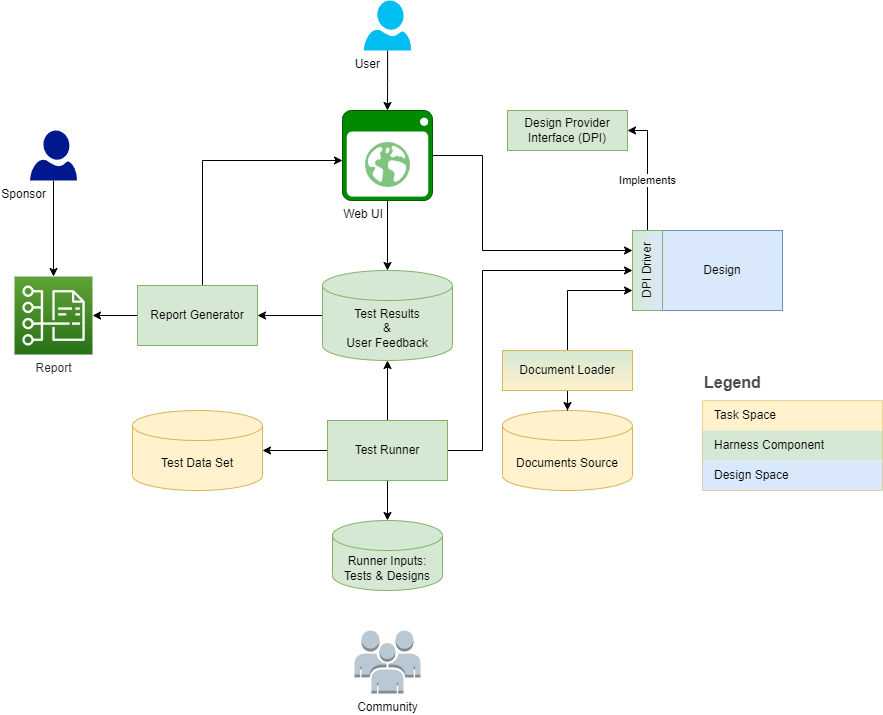

# Document Retrieval Augmented Generation (RAG) Harness

The area of Retrieval Augmented Generation is rapidly evolving. There are many different ways to implement retrieval. 
Some people use embeddings and vector databases, some other use semantic graphs.
So, there are different designs and also there are different tasks and it is important to match a design to a task[^1].

[^1]: [Design Space for Graph Neural Networks](https://arxiv.org/pdf/2011.08843.pdf), [Lecture](https://www.youtube.com/watch?v=8OhnwzT9ypg&list=PLoROMvodv4rPLKxIpqhjhPgdQy7imNkDn&index=60) part of [Stanford CS224W: ML with Graphs](https://www.youtube.com/watch?v=JAB_plj2rbA&list=PLoROMvodv4rPLKxIpqhjhPgdQy7imNkDn), [Slides](http://snap.stanford.edu/class/cs224w-2021/slides/20-conclusion.pdf)

 
The goal of this harness to provide a collection definitions, abstractions, and building blocks to aid in understanding, benchmarking, comparing, and selecting a specific retrieval design which best matches a task at hand. 

The harness is intended to be somewhat similar to a Technology + [Technology Compatibility Kit (TCK)](https://en.wikipedia.org/wiki/Technology_Compatibility_Kit) - to provide:

* Java/EMF Ecore model/API for document storage and retrieval including "Design Provider Interface" to be implemented by candidate designs
* Testing framework for evaluate how different designs perform a specific task.    

Java was selected as a dominant technology in the enterprise world with rich expressive power of the language and large mature ecosystem. EMF Ecore was selected because there are capabilities:

* Load/store models from/to YAML, XMI and binary files as well as databases
* Generate HTML documentation from models and metamodels
* Tooling support for building viewers and editors - tree, diagram, text; Eclipse IDE and Web Browser

This page provides an introduction to core concepts and outlines several use cases (tasks) and designs (alternatives). 

## Concepts

The below diagram outlines the harness structure and context:

The following sections provide definitions and outline task/design dimensions for each definition. 
The [metamodel](https://doc-rag-harness.ai-deep-learning.us/) captures some of the definitions as model elements and elaborates them into features, operations, and subclasses.

### Document

Document is memorialized representation of thought or information. For the purposes of this harness documents:

* Are stored in a document source/repository (like books in a library)
* Can be categorized and categories can be nested (e.g. book genre - fiction / sci-fi)
* Can have internal structure (e.g. volume, chapter, section, paragraph, word)
* Can contain different types of contents - text, image, video, audio, structures like lists and tables
* Can reference other documents or external entities

"Physical" implementations:

* Text file
* PDF. In Java can be loaded using [Apache PDFBox](https://pdfbox.apache.org/)
* OCR result in, say, JSON
* MS Office documents - in Java can be loaded with [Apache POI](https://poi.apache.org/). MS Excel files can be loaded as Ecore model with [Nasdanika Excel Model](https://github.com/Nasdanika-Models/excel) 
* HTML documents/pages (subtype of text)

"Logical" implementations:

* For PDF/OCR - a scan of a business document. For example, a fax of a SWIFT message. In this case:
    * Header and footer added by the fax might be removed as irrelevant
    * Page bodies might be parsed into a SWIFT specific structure, e.g. [MT 700](https://www2.swift.com/knowledgecentre/publications/us7m_20210723/1.0?topic=mt700-format-spec.htm)
* For HTML - a documentation page. Say, [Spring Expression Language (SpEL)](https://docs.spring.io/spring-framework/reference/core/expressions.html) In this case header, left navigation, right sidebar, and footer might be discarded as not relevant or parsed into respective logical document features which might be ignored. Breadcrumb can be used for categorization.      
* For text files - depending on the content type. E.g. ``pom.xml`` can be loaded into a Project Object Model, Java file can be loaded into a syntax tree or a graph with resolved type/field/method references.

### Document Loader

Converts one document representation to another. E.g. PDF or OCR JSON to an object model of a SWIFT MT 700 message. 

### Documents Source 

Storage of documents in a specific format or formats. E.g. a file system with PDF documents. Documents sources may be converted/adapted. 
One of examples of document source is a Git commit. 
[Nasdanika GitLab](https://github.com/Nasdanika-Models/gitlab) model can be used to implement document loading from GitLab. 

### Document Repository

A collection of documents providing storage and retrieval functionality. 
The primary interface of the DPI (see below) to be implemented by designs.

When storing a document the repository may perform tasks such as image recognition.  

There might be multiple retrieval modalities such as:

* Keyword search
* Semantic search
* Summarization - search and summarize top X results

Repositories can be assembled from other repositories and data loaders. E.g. a PDF repository may be assembled from a PDF -> Object model data loader and an object model repository.
Also document repositories may not have to store/recreate the source document - they may reference it and retrieve from a document store - the original from which the document was loaded, or a repository-specific document store.

It might also be possible to compose different designs of repositories. For example, a repository which supports keyword search and a repository which supports semantic search. In this case the keyword search repository query results would be necessary, but not sufficient and might be use to validate results of the semantic search repository.  

### User / Web UI

Users query a document repository via the Web UI. They can do it as part of their job function or to evaluate query functionality of a specific design and provide feedback. 
These two modalities may be combined - users may choose to use only the "champion" query engine/design, e.g. keyword search, or also select "challenger" engines/designs.

The Web UI might capture user context such as role/position in the organization and pass it to the design as part of a query.  

### Sponsor

A party interested in improving qualities of user work such as productivity by utilizing document retrieval augmented generation. 

Sponsors need to balance multiple criteria to minimize the "loss function":

* Retrieval speed
* Accuracy   
* Completeness
* Costs such as running costs, license costs etc.

### Design

Design is an instantiation/embodiment of technologies and their configuration parameters.

#### Design dimensions

Design variation points - what can be changed in different embodiments/instantiations and source of values. 
For example:

* Number of embedding dimensions
* ML model
* Model temperature
* Vector database 
* Vector database version

Design dimensions can form a tree or, more precisely, a directed graph. E.g. vector database versions would be nodes under a node for a specific vector database. 

### Design Provider Interface

Design Provider Interface (DPI) abstracts the harness from a particular design implementation. It is a set of interfaces and abstract classes which design has to implement.
E.g. ``DocumentRepository`` interface. DPI is defined in Java/Ecore and may provide adapters to different technologies. In particular:

* REST API 
* Language bindings and a runner which implements the REST API and calls components which implement the language binding interface. For example a Python binding can be implemented with [Flask](https://palletsprojects.com/p/flask/)
* Framework bindings/implementations under language bindings or directly under the DPI in Java. E.g. under the Python binding there might be a [LangChain](https://www.langchain.com/) binding and under Java there might be [OpenNLP](https://opennlp.apache.org/) binding

### Task

Task is a specific use of document retrieval. For example, semantic search in organizaiton-specific technical documentation "How do I deploy a Spring microservice to AKS?". 

### Test Data Set

A collection of test documents, queries, and evaluators of responses. 

### Runner Inputs

A collection of Test Data Set / Design combinations to be executed by the test runner.

### Test Runner

* Reads inputs
* Instantiates test data sets and designs
* Loads documents from a test data set into a design
* Executes queries and evaluates responses. Response evaluators may provide feedback to the design
* Stores test results for further analysis and report generation

Test runner may execute only parts of the above steps depending on inputs. 
For example:

* There might be already a design with pre-loaded documents and the test runner will execute only the querying part
* Or the test data set may contain only documents, but not queries and response evaluators because queries and responses are to be provided by users via the Web UI
* Test Runner may load documents to the design and save it as a new design. E.g. create a container from an image, load documents, and then stop container and create an image from the container.
* Similarly, the Test Runner may take a test data set, combine it with user provided feedback and create and create a new test data set.

Test runs can be distributed across multiple agents/machines.

### Test Results & User Feedback

Storage of test results and user feedback. 
Test results and user feedback shall reference test data sets and designs. 
As such, it is essentially a harness metadata repository containing design definition trees/graphs, test data set definitions, and results of test runs.

### Report Generator

Generates a report. The report might be in HTML format with visualizations. 
A possible report format:

* Left panel with the designs tree, tasks tree, and test data sets for tasks. It may also include a "tech stack tree" - categorized design building blocks. For example, a tree of vector databases, their versions and configurations. If the left panel becomes too noisy, some of the items can be moved to the navigation bar.  
* Content panel - documentation for the selected item. E.g.
    * Home page - a summary of performed tests: filterable sortable table with design/test permutations (for relatively small spaces), visualizations, e.g. [ECharts](https://echarts.apache.org/examples/en/index.html) [3D Scatter](https://echarts.apache.org/examples/en/editor.html?c=scatter3d&gl=1&theme=dark). It may also contain a design wizard to build designs by answering questions and selecting a tested design which best fits the answers.
    * Design page - configuration, tests and results - table, visualizations
    * Task page - description, tests, designs, visualizations. It may host an aggregation Web UI which collects answers from all designs for this task and allows users to compare responses from alternative designs. One option to compare is [Pairwise comparison](https://en.wikipedia.org/wiki/Pairwise_comparison) possibly without reveling which design a given response comes from.
    * Building block (e.g. vector database, its version, configuration) - description, designs which use it. 
    
Report may contain links to the Web UI or even "host" the Web UI if it is implemented as a Single Page Application (SPA) with, say, [React](https://react.dev/) or [Vue.js](https://vuejs.org/)/[BootstrapVue](https://bootstrap-vue.org/)     
    
--- Work in progress ---    
    
## Tasks

This section outlines several tasks (use cases) for retrieval augmented generation and search in general.

Dimensions:

* Number of documents
* Number of users
* Frequency of changes
* Privacy
* Risk - cost of error

### Technical documentation

Example - technology function in a large enterprise:

* Multiple levels:
    * Corporate, binds enterprise-wide technology choices (e.g. Java/Spring, Maven components), provides enterprise-wide shared building blocks (e.g. a library of Bootstrap components) and other technology (e.g. a build pipeline)
    * Segment - narrows technology choices, e.g. version of Java, add segment-specific ways of doing things on top of the enterprise guidelines (which are in turn built on top of the industry/vendor technology guidelines and documentation). May introduce segment-level building blocks.
    * Capability/team - narrows technology choices even further and refines how they are used. May introduce capability/team level building blocks such as widget libraries.
    
For each of the above there is a time dimension - tech stack updates on the top, releases on the bottom. 
See [TOGAF Architecture Landscape](https://pubs.opengroup.org/togaf-standard/applying-the-adm/chap03.html#tag_03_02) for a visualization.

In such an environment users need a retrieval solution which allows to retrieve documents specific to the user's position and role in the enterprise and the effort they are assigned to.
E.g. a Java developer working on, say the current release may need information about Java 17. If the same developer is assigned to work on the future release they might need information about, say, Java 20.
When they work with technologies such as Kubernetes and Azure AKS, the vendor documentation might be largely useless and cause confusion because it contains general information, but they need to know about enterprise/segment specific ways of doing things.  

* Number of documents: Tens of thousands
* Number of users: Hundreds to thousands
* Frequency of changes: Low (e.g. monthly) to Moderate (several times a month)
* Privacy: Internal
* Risk: Low 

### Procedures

Dimensions:

* Number of documents: Low thousands
* Number of users: Hundreds to thousands
* Frequency of changes: Low (e.g. monthly)
* Privacy: Internal, Restricted, Confidential 
* Risk: Medium to High

### Operational Documents

Dimensions:

* Number of documents: Possibly millions
* Number of users: Hundreds to thousands
* Frequency of changes: High (daily)
* Privacy: Confidential, personal information - PII, PHI, PCI 
* Risk: High

## Designs

### Embeddings, vector databases, LLM's

TODO. According to industry information targets a very large number of documents - matches the Operational Documents Use Case

### Graphs

TODO. May be better for a smaller number of documents (procedures) - they may all fit in memory and searches can be performed on semantic graphs. 
In the vector database case one way to build indexes is to use graphs - [Hierarchical Navigable Small World (HNSW)](https://towardsdatascience.com/similarity-search-part-4-hierarchical-navigable-small-world-hnsw-2aad4fe87d37)

### Polymorphic graphs

TODO. Might be a good fit for the technical documentation use case:

* The enterprise builds a knowledge graph (model) for the enterprise technology choices. There might be multiple models - baseline, future releases
* Segments take the enterprise graphs/models and customize - the concept similar to inheritance in object-oriented languages such as Java and also similar to layers in Docker
* Capabilities/teams may take it further

This process will result in a large number (hundreds) of relatively small graphs/models (knowledge bases) with tens of thousands of documents. 

